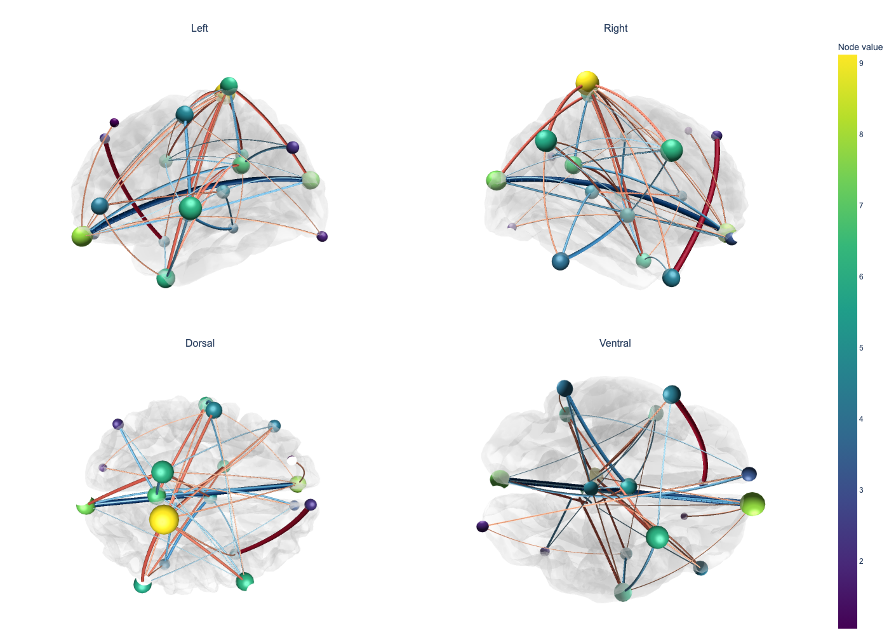
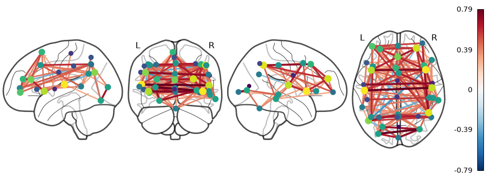
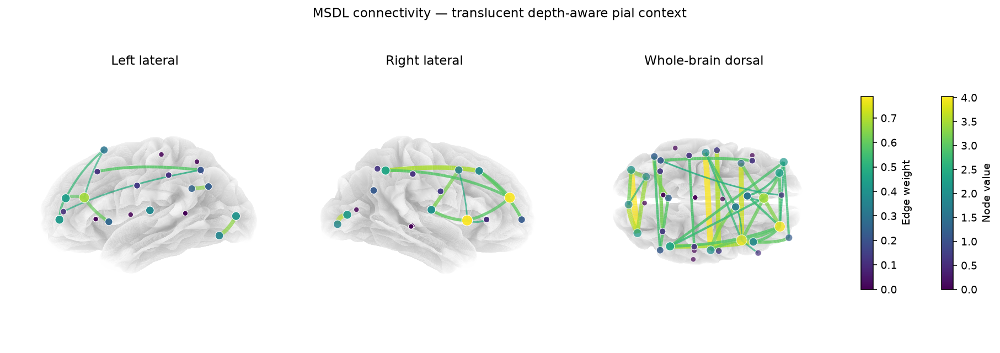
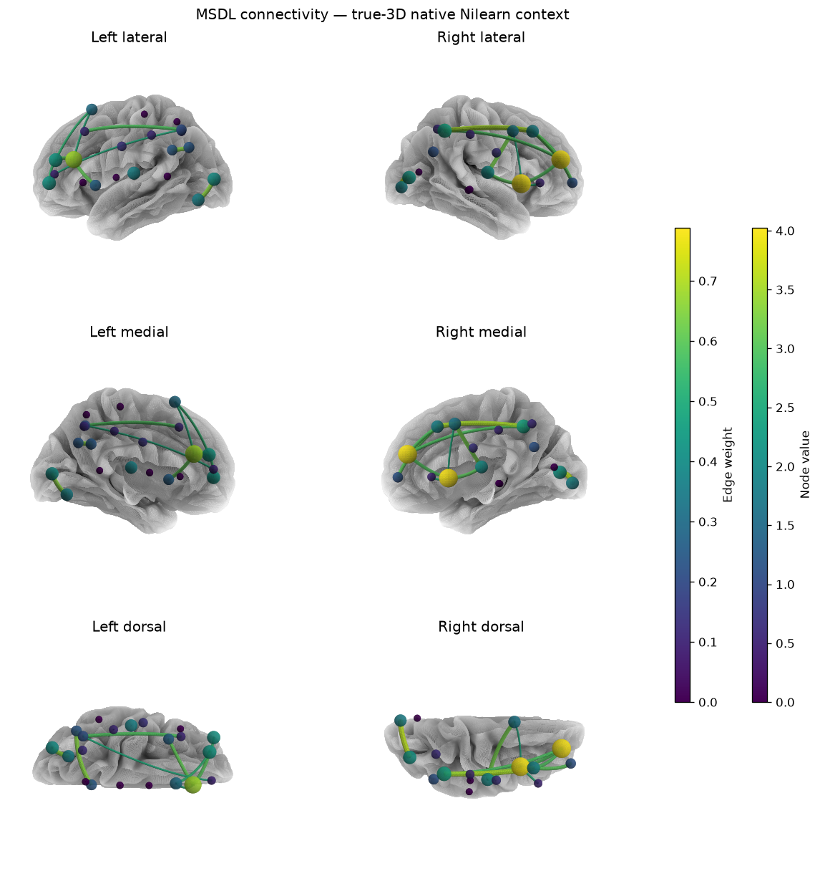
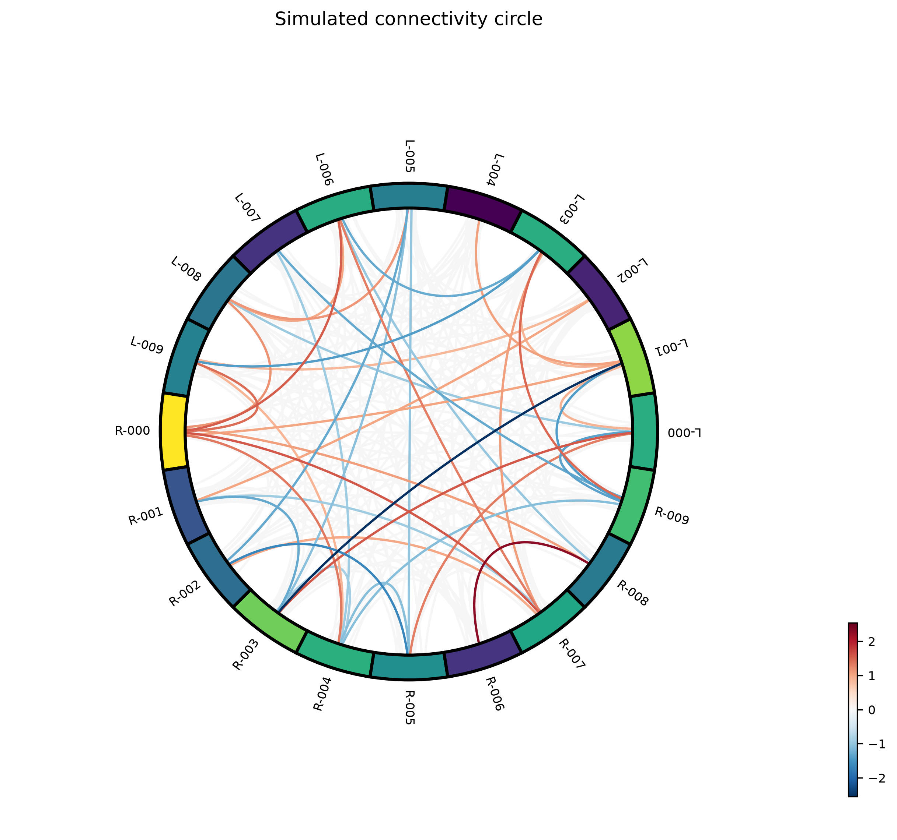

# PyConnviz

English | [简体中文](README.zh-CN.md)

PyConnviz 0.1.0 is a Nilearn-first Python library for publication-quality
visualization of already-computed MEG/EEG source-space ROI connectivity. It
creates static and interactive cortical surface networks, Nilearn glass-brain
and HTML connectomes, and MNE-Connectivity circle plots.

PyConnviz does not compute connectivity, localize sources, perform statistical
tests, choose significant edges, or download templates. It has no GUI or CLI.

## Gallery

The figures below are generated by PyConnviz from the repository's validated
examples. The recommended Plotly and glass-brain previews use deterministic
simulated connectivity. The fixed-view Matplotlib and native Nilearn figures
use real MSDL connectivity projected to fsaverage.

<table>
  <thead>
    <tr>
      <th>Recommended: Plotly surface interactive preview</th>
      <th>Recommended: Nilearn glass brain</th>
    </tr>
  </thead>
  <tbody>
    <tr>
      <td width="50%"></td>
      <td width="50%"></td>
    </tr>
  </tbody>
</table>

<table>
  <thead>
    <tr>
      <th>Supplementary: Matplotlib three-view surface</th>
    </tr>
  </thead>
  <tbody>
    <tr>
      <td></td>
    </tr>
  </tbody>
</table>

<table>
  <thead>
    <tr>
      <th>Supplementary: native Nilearn six-view surface</th>
    </tr>
  </thead>
  <tbody>
    <tr>
      <td></td>
    </tr>
  </tbody>
</table>

<p align="center">
  
</p>

## Installation

PyConnviz requires Python 3.10 or newer.

### Install from PyPI

Install the latest published release from
[PyPI](https://pypi.org/project/pyconnviz/):

```bash
python -m pip install --upgrade pyconnviz
python -m pip install --upgrade "pyconnviz[interactive]"
python -m pip install --upgrade "pyconnviz[interactive,export]"
```

The first command installs the core static renderers. Use `interactive` for
Plotly HTML surfaces; combine `interactive,export` when Plotly static
PNG/SVG/PDF export through Kaleido is also required.

For a source checkout or release-development environment:

```bash
python -m pip install -e .
python -m pip install -e ".[dev,interactive,export]"
```

For a fully reproducible acceptance environment, install with
`-c constraints-dev.txt`. Importing `pyconnviz` does not access the network,
download data, import Plotly, or open a plotting window.

## Recommended views

Choose the view for the question being answered:

1. The Plotly surface is the **primary interactive anatomical view**. It keeps
   surface-RAS geometry, rotates freely, and lets you inspect whether an edge
   lies in front of or behind the cortex. Nodes and edges are a true-3D
   ball-and-stick network built from `Mesh3d` spheres and tubes, rather than
   screen-space markers and lines.
2. The Nilearn glass brain is the **primary static connectivity overview**
   when valid MNI coordinates are available. It avoids cortical occlusion and
   makes the complete whole-brain graph easiest to compare.
3. Matplotlib and native Nilearn surfaces are **supplementary fixed-view
   anatomical context**. Their translucent cortex and camera-depth alpha cue
   improve spatial reading, but a fixed 2D projection is not a physical tube
   rendering or a substitute for the rotatable Plotly view.

The corresponding calls, in recommended order, are:

```python
plot_connectome(
    prepared,
    geometry,
    backend="surface",
    engine="plotly",
    output="surface_interactive.html",
)
plot_connectome(
    prepared,
    geometry,
    backend="glass",
    output="glass_brain.svg",
)
plot_connectome(
    prepared,
    geometry,
    backend="surface",
    engine="matplotlib",
    depth_cue=True,
    output="surface_context.png",
)
```

The dispatcher still defaults to the dependency-light Matplotlib renderer for
backward compatibility. “Recommended” here is a presentation choice, not a
change to edge selection or the public default.

## Quickstart

This runnable example uses a tiny simulated bilateral mesh so it needs no
download. Real cortical surfaces normally come from FreeSurfer. Geometry owns
the node order and coordinate spaces; the connectivity matrix uses the same
node order.

```python
import numpy as np
from pyconnviz import (
    HemisphereMesh,
    geometry_from_arrays,
    plot_connectome,
    prepare_connectome,
)

faces = np.array([[0, 1, 2], [0, 3, 1], [0, 2, 3], [1, 3, 2]])
left_xyz = np.array([[-4, -1, -1], [-2, -1, 1], [-4, 1, 1], [-2, 1, -1]])
right_xyz = left_xyz + [6, 0, 0]
geometry = geometry_from_arrays(
    ("L-a", "L-b", "R-a", "R-b"),
    np.array([left_xyz[0], left_xyz[3], right_xyz[0], right_xyz[3]]),
    ("left", "left", "right", "right"),
    {
        "left": HemisphereMesh(left_xyz, faces),
        "right": HemisphereMesh(right_xyz, faces),
    },
    mni_coords=np.array([
        [-30, -10, 20], [-20, 10, 20], [20, -10, 20], [30, 10, 20]
    ]),
    node_vertices=np.array([0, 3, 0, 3]),
)
matrix = np.array([
    [0.0, 0.4, -0.8, 0.0],
    [0.4, 0.0, 0.6, 0.0],
    [-0.8, 0.6, 0.0, 1.0],
    [0.0, 0.0, 1.0, 0.0],
])
prepared = prepare_connectome(
    matrix,
    geometry=geometry,
    max_edges=4,
)

# Recommended rotatable anatomical view (install pyconnviz[interactive]).
interactive = plot_connectome(
    prepared,
    geometry,
    backend="surface",
    engine="plotly",
    output="quickstart_surface.html",
)

# Recommended static overview when geometry.mni_coords is valid MNI space.
glass = plot_connectome(
    prepared,
    geometry,
    backend="glass",
    output="quickstart_glass.svg",
)

# Base-install fallback and supplementary fixed anatomical context.
surface = plot_connectome(
    prepared,
    geometry,
    engine="matplotlib",
    depth_cue=True,
    output="quickstart_surface.png",
)
print(interactive.output_files, glass.output_files, surface.output_files)
print(prepared.edges)  # exact same immutable edges in every figure
```

`examples/01_numpy_surface.py` is the base-install static variant;
`examples/04_all_backends.py` exports every renderer from one prepared network.

## All rendering modes

Every renderer consumes the same immutable `PreparedConnectome`; a backend
never thresholds or ranks the matrix a second time.

| Backend | Engine | Required coordinates | Outputs | Install extra |
|---|---|---|---|---|
| `surface` | `plotly` | surface-RAS + surface mesh | offline HTML; PNG, SVG, PDF with Kaleido | `interactive`; `export` for static files |
| `glass` | Nilearn | MNI millimetres | PNG, SVG, PDF | none |
| `html` | Nilearn `view_connectome` | MNI millimetres | offline HTML | none |
| `surface` | `matplotlib` | surface-RAS + surface mesh | PNG, SVG, PDF | none |
| `surface` | `nilearn` (`plot_img_on_surf`) | registered pial/inflated mesh | PNG, SVG, PDF | none |
| `circle` | MNE-Connectivity | node order only | PNG, SVG, PDF | none |

Prepare once and select any output without changing the scientific edge set:

```python
from pyconnviz import plot_connectome, prepare_connectome

prepared = prepare_connectome(
    matrix,
    geometry=geometry,
    edge_threshold="75%",
    max_edges=120,
)

plot_connectome(
    prepared,
    geometry,
    backend="surface",
    engine="plotly",
    output="surface_interactive.html",
)
plot_connectome(prepared, geometry, backend="glass", output="glass_brain.svg")
plot_connectome(prepared, geometry, backend="html", output="connectome.html")
plot_connectome(
    prepared,
    geometry,
    backend="surface",
    engine="matplotlib",
    depth_cue=True,
    output="surface_context.png",
)
plot_connectome(
    prepared,
    geometry,
    backend="surface",
    engine="nilearn",
    views=["lateral", "medial", "dorsal"],
    hemispheres=["left", "right"],
    depth_cue=True,
    output="surface_nilearn_context.png",
)
plot_connectome(prepared, geometry, backend="circle", output="circle.png")
```

The same calls with `style="soft"` or `style="dark"` select another built-in
visual style. `examples/04_all_backends.py` is the complete offline exporter.

## NumPy connectivity and explicit geometry

A two-dimensional NumPy input must be a square node-by-node matrix. Symmetric
matrices are undirected; asymmetric matrices are directed when
`directed="auto"`. A triangular NumPy matrix is intentionally not guessed—set
`symmetrize="lower"` or `symmetrize="upper"` when that is the scientific
meaning of the stored data.

For higher-dimensional arrays, name both node axes and every axis to reduce:

```python
prepared = prepare_connectome(
    connectivity_by_epoch_frequency_node_node,
    geometry=geometry,
    node_axes=(-2, -1),
    reduce_axes=(0, 1),
    reduction="mean",
    edge_mask=corrected_p < 0.05,
    edge_threshold=0.20,
    max_edges=120,
)
```

Array axes are never silently flattened. Use `complex_mode="magnitude"`,
`"real"`, or `"imag"` when a complex matrix has an explicit scientific
interpretation.

## MNE labels and FreeSurfer geometry

PyConnviz preserves label order exactly. Filter or reorder labels before
constructing geometry so the order remains identical to the matrix node order.

```python
import mne
from pyconnviz import geometry_from_mne_labels

labels = mne.read_labels_from_annot(
    subject="fsaverage", parc="aparc", subjects_dir=subjects_dir
)
labels = [
    label for label in labels
    if "unknown" not in label.name.lower()
    and "corpuscallosum" not in label.name.lower()
]
geometry = geometry_from_mne_labels(
    labels,
    subject="fsaverage",
    subjects_dir=subjects_dir,
    src=src,
    surface="inflated",
    sphere_surface="sphere",
)
```

`examples/02_mne_labels_surface.py` uses a user-supplied local FreeSurfer
subject. PyConnviz does not download `fsaverage` or any other subject.

## MNE-Connectivity frequency, time, and epoch selection

Common bivariate MNE-Connectivity objects are adapted through their public
`get_data(output="dense")`, `dims`, `coords`, `names`, and `n_nodes` APIs.

```python
result = plot_connectome(
    spectral_connectivity,
    geometry,
    freq=(8.0, 13.0),
    reduction="mean",
    edge_mask=corrected_p < 0.05,
    max_edges=120,
    output="alpha_surface.svg",
)
```

A scalar frequency/time selects the nearest public coordinate. A two-value
range selects all coordinates inclusively and reduces by `mean` or `median`.
Non-singleton frequency, time, or epoch dimensions require an explicit
selector. Multivariate component dimensions are never silently flattened.

MNE-Connectivity 0.9.0 stores audited all-to-all bivariate spectral results in
the lower triangle of its public dense representation. In the default
`symmetrize="auto"` path, PyConnviz now reconstructs the complete undirected
matrix only when `indices is None` and the public `method` is a whitelisted
symmetric scalar metric (`coh`, `plv`, `ciplv`, `ppc`, `pli`,
`pli2_unbiased`, `wpli`, or `wpli2_debiased`). Directed methods such as `dpli`,
explicit indexed pairs, Granger measures, and complex coherency are not
silently mirrored. The inference basis is preserved in result metadata.

## Prepared data and renderer invariants

Scientific edge selection happens only in `prepare_connectome`. Renderers
receive the same immutable `PreparedConnectome` and cannot threshold or rank
again.

```python
from pyconnviz import plot_connectome, prepare_connectome

prepared = prepare_connectome(
    connectivity,
    geometry=geometry,
    freq=(8.0, 13.0),
    edge_mask=corrected_p < 0.05,
    max_edges=120,
)
interactive = plot_connectome(
    prepared,
    geometry,
    backend="surface",
    engine="plotly",
    static_views=("left", "right", "dorsal", "ventral"),
    image_width=1400,
    image_height=1000,
    output=("alpha_surface.html", "alpha_surface.png"),
)
glass = plot_connectome(prepared, geometry, backend="glass", output="alpha_glass.svg")
surface = plot_connectome(
    prepared,
    geometry,
    engine="matplotlib",
    depth_cue=True,
    output="alpha_surface_context.png",
)
circle = plot_connectome(prepared, geometry, backend="circle", output="alpha_circle.png")
native_html = plot_connectome(
    prepared,
    geometry,
    backend="html",  # direct nilearn.plotting.view_connectome wrapper
    output="alpha_connectome.html",
)
```

## Native Nilearn pial montage

Use `engine="nilearn"` for a native `plot_img_on_surf` pial montage. Pure
connectivity should omit `stat_map`; pass one only when that statistical volume
actually belongs to the analysis. A FreeSurfer subject directory can be passed
directly; PyConnviz validates its local pial, inflated, sulcal, and curvature
files and never downloads a replacement.

```python
native_surface = plot_connectome(
    prepared,
    pial_geometry,  # node_vertices index the same full fsaverage topology
    backend="surface",
    engine="nilearn",
    surf_mesh="data/fsaverage",
    views=["lateral", "medial", "dorsal"],
    hemispheres=["left", "right"],
    bg_on_data=True,
    symmetric_cmap=None,
    symmetric_cbar="auto",
    inflate=False,
    depth_cue=True,
    output="native_surface_three_views.png",
)
```

Nilearn creates the Cartesian product of view modes and hemispheres, so this
example produces three view rows and two hemisphere columns: six cortical
panels. The single-hemisphere lateral panels show their complete
intra-hemisphere prepared edge subset; they intentionally cannot show
cross-hemisphere edges. Use the custom Matplotlib `both` panel, the rotatable
Plotly surface, the glass brain, or the native `view_connectome` HTML backend
when cross-hemisphere edges must appear in one view.

For this pure-connectivity call the native engine supplies an internal transparent
all-zero Niimg only because `plot_img_on_surf` requires a volume. The visible
cortex remains neutral and carries no inferred functional values. Per-vertex
`surface_values` and functional `node_overlay` modes stay on the Matplotlib or
Plotly engines; PyConnviz never reconstructs a volume from vertex values.

An explicit `stat_map=stat_img` remains available for a separate, labelled
volume-to-surface analysis. Its colours and statistical colorbar then represent
that supplied image, never the connectivity matrix.

Passing `edge_threshold`, `edge_mask`, `max_edges`, `freq`, `time`, or another
scientific option with an already-prepared object is an error.

## Node and edge visual encodings

Node color can be selected with `node_color_by="strength"`, `"hemisphere"`,
`"group"`, or `"custom"`; group coloring requires `geometry.groups`. Node size
accepts `node_size_by="strength"` or `"custom"`. Supply the common custom vector
with `node_values`, or use `node_color_values` and `node_size_values` when color
and size must use different finite numeric vectors. These options are display
mappings only and never alter `PreparedConnectome.edges`.

`edge_cmap="auto"` preserves signed versus one-sided color semantics. An
explicit Matplotlib colormap name overrides only the display palette and is
forwarded consistently to surface, glass, HTML, and circle backends.

## Styles and custom views

`style="paper"`, `style="soft"`, and `style="dark"` are complete visual
presets. Inspect a copy of their resolved values without mutating global state:

```python
from pyconnviz import ViewSpec, get_style, plot_connectome

print(get_style("paper"))
custom_views = (
    ViewSpec("left", "lateral", "Left lateral"),
    ViewSpec("right", "lateral", "Right lateral"),
    ViewSpec("both", (80.0, -90.0), "Whole-brain dorsal"),
)
plot_connectome(
    prepared,
    geometry,
    backend="surface",
    engine="matplotlib",
    views=custom_views,
    style="paper",
    output="custom_views.svg",
)
```

String presets such as `views="paper"`, `views="four"`, and `views="whole"`
are available for the Matplotlib surface engine. The native Nilearn engine
accepts Nilearn view strings; Plotly uses `view` for its initial camera and
`static_views` for a multi-view static export.

Surface overlays have a separate `surface_cmap` (default `"RdBu_r"`), while
`node_cmap` controls node markers. Changing either palette is display-only and
cannot alter the prepared edge set. Every built-in style defaults to a neutral
grayscale cortex and `node_overlay="none"`; a functional cortical color map is
created only when `surface_values` or an explicit non-`"none"` overlay is
provided. With no overlay, PyConnviz still sends a transparent surface map
through Nilearn so the configured cortex luminance and sulcal background remain
visible instead of falling back to a white mesh.

An explicit `cortex_alpha` controls cortical opacity in all three surface
engines and must be a finite value from `0` to `1`. With no explicit value,
Plotly retains the interactive style defaults (`0.24 / 0.20 / 0.32` for
`paper / soft / dark`). Matplotlib and native Nilearn use more transparent
static fixed-view defaults (`0.08 / 0.08 / 0.18`) so internal connections
survive a fixed projection. Their default edge visibility budgets are also
renderer-specific: paper uses alpha `0.95`, a `1.4–5.4` point width range, and
a `0.70` minimum projected-depth factor. Explicit `edge_alpha`,
`edge_width_range`, and `cortex_alpha` always override these visual defaults.

Both fixed-view engines default to `depth_cue=True`: each prepared curve is
divided into display segments and only its alpha is modulated by projected
camera depth. Nearer segments remain stronger and farther segments become
fainter, but the raised floor prevents valid edges from disappearing at README
thumbnail scale. Edge color still encodes sign/magnitude, edge width still
encodes absolute weight, and every panel retains its complete
hemisphere-scoped edge set. Set `depth_cue=False` for uniform line alpha.

## Coordinate contract: surface-RAS versus MNI

`ConnectomeGeometry.surface_coords` belongs to the displayed surface mesh,
normally a FreeSurfer surface-RAS space such as an individual subject's
inflated surface. Only the Matplotlib and Plotly surface backends use it.

`ConnectomeGeometry.mni_coords` contains millimetre MNI coordinates. Only the
Nilearn glass and HTML backends use it. Inflated surface coordinates are never
substituted for MNI coordinates; a missing required coordinate field fails
immediately.

`min_distance_mm` currently uses Euclidean distance between `surface_coords`.
It is a display filter, not a geodesic or anatomical-distance claim.

## Mask, threshold, percentile, and top-K semantics

The exact filtering order is:

1. discard diagonal and non-finite candidates;
2. apply `edge_mask`;
3. apply `keep_sign`;
4. apply `min_distance_mm`;
5. apply `edge_threshold`;
6. stable-sort by absolute weight, source, target;
7. apply `max_edges`.

`edge_mask` expresses externally computed eligibility or statistical
significance. A numeric `edge_threshold` keeps `abs(weight) >= threshold`; a
string such as `"95%"` computes the percentile only from candidates that
survived earlier filters. `max_edges` is a deterministic visualization cap.
These are intentionally separate concepts.

## Complex, signed, nonnegative, triangular, and directed data

Complex input raises by default. Choose `complex_mode="magnitude"`, `"real"`,
or `"imag"` explicitly. PyConnviz never infers a conversion from a metric name.

When both positive and negative visible edges exist, renderers use a
zero-centred divergent color scale. Nonnegative coherence/wPLI-like data use a
sequential scale rather than a misleading red/blue signed scale.

A triangular NumPy matrix is not guessed to be undirected. Use
`symmetrize="lower"` or `symmetrize="upper"` explicitly. An asymmetric matrix
is directed in `directed="auto"` mode and preserves source-to-target order:

```python
directed = np.array([[0.0, 0.8], [-0.2, 0.0]])
result = plot_connectome(
    directed,
    geometry,
    directed=True,
    max_edges=2,
    output="directed_surface.png",
    show_arrows=True,
)
```

## Surface overlays

`node_overlay` can be `"none"`, `"roi"`, `"gaussian"`, or `"vertex"`. The
default is always `"none"`, including `style="soft"`.

- ROI mode assigns node values to explicit `roi_vertices`.
- Gaussian mode spreads values over a radius-truncated sparse mesh graph and
  never crosses hemispheres. Euclidean distance requires an explicit option.
- Vertex mode displays user-supplied real per-vertex values and has highest
  priority.

Gaussian overlay is visual interpolation only. It does not represent source
reconstruction, cortical propagation, or statistical significance.

## Interactive and static export details

`show=False` is the default and supports `MPLBACKEND=Agg` on headless systems.
Plotly HTML uses embedded JavaScript by default so it can be opened offline.
`image_width`, `image_height`, and `image_scale` control Plotly static export
without changing the interactive data. Static Plotly output defaults to one
two-column montage containing `left`, `right`, `dorsal`, and `ventral` scenes;
customize that order with `static_views`, or pass `static_views=None` to export
only the singular interactive `view` camera. For this backend,
`node_size_range` and `edge_width_range` set physical diameters in millimetres;
perspective and camera rotation therefore change the apparent size of the
spheres and tubes naturally.

The two interactive outputs answer different questions. The Plotly `surface`
backend preserves cortical anatomy and supports explicit per-vertex overlays;
the native Nilearn `html` backend calls `view_connectome` and is generally
clearer for rotating and inspecting the whole connection graph because it does
not use an occluding cortical mesh. They use the same prepared edge matrix, but
surface rendering uses surface-RAS coordinates whereas `view_connectome`
requires MNI millimetres.

The acceptance generator uses both the `fsaverage5` cortex bundled inside
Nilearn and the full-resolution `data/fsaverage` subject supplied with this
workspace. The native acceptance montage uses its 163,842-vertex pial mesh and
the neutral no-`stat_map` path, so its cortex has no unrelated statistical
projection. The generator also emits `surface_interactive.html` together with
a 1400×1000 four-view `surface_interactive.png`, and refreshes
`surface_fsaverage_full.png` through the same translucent, depth-aware pial
renderer as `surface_paper.png`. Library plotting calls still require explicit
geometry and never substitute or download a template silently.

## Build and publish

`pyproject.toml` is the single source of package metadata and build
configuration. PyConnviz uses the PEP 517 `setuptools.build_meta` backend and
intentionally has no `setup.py` entry point.

Install the release tools once:

```bash
python -m pip install -e ".[dev]"
```

Use the unified release script from the repository root. Each action builds in
a fresh temporary directory, validates the exact new wheel and sdist, and
copies them to `dist/` before stopping or uploading:

```bash
./scripts/release.sh build       # build + twine check; never uploads
./scripts/release.sh testpypi    # build + check + TestPyPI upload
./scripts/release.sh pypi        # build + check + confirmed production upload
```

Running `./scripts/release.sh` with no action is equivalent to `build`. The
production action asks you to type `release pyconnviz`; non-interactive release
automation must opt in explicitly with `./scripts/release.sh pypi --yes`.
Twine obtains credentials from its standard environment variables, keyring, or
configuration file—the script never stores them. Set `PYCONNVIZ_PYTHON` to
override the default `.venv/bin/python` discovery.

For troubleshooting, the modern PEP 517 steps performed by the build action
can also be run manually:

```bash
python -m build
python -m twine check dist/*
```

The resulting files are `dist/pyconnviz-0.1.0.tar.gz` and
`dist/pyconnviz-0.1.0-py3-none-any.whl`. After the `testpypi` action, install
and inspect that release before publishing to the production index:

```bash
python -m pip install \
  --index-url https://test.pypi.org/simple/ \
  --extra-index-url https://pypi.org/simple/ \
  pyconnviz
```

The two upload actions change external state and require maintainer credentials.
The script uploads only artifacts created in its current temporary staging
directory, never a broad `dist/*` glob that could include an older release.

The gallery uses repository-relative files from `docs/images`. Before a PyPI
release, configure the public project/repository URLs and, if the target PyPI
renderer does not display relative images, change those five image references
to absolute URLs served by the public repository.

## Real upstream accuracy audit

The validation script runs two real-data Nilearn cases (MSDL atlas correlation
and Power-264 sphere extraction with `GraphicalLassoCV`), two independently
computed MNE-Connectivity cases (`coh` and `plv`), and one MSDL-to-fsaverage
surface case. It preserves five official Python examples with URLs and SHA-256
digests, calculates independent edge/strength oracles, and writes JSON,
Markdown, PNG, HTML, NumPy arrays, per-case manifests, and labelled comparison
figures under `artifacts/upstream_validation`.

For each matched renderer comparison, the upstream plotting function and
PyConnviz receive the same prepared matrix, coordinates, node style, edge
style, and disabled renderer-side threshold. This separates scientific data
parity from known differences among upstream default thresholds. Native
default outputs remain visible as diagnostic evidence instead of being treated
as matched renderings.

The first run needs network access for the official sources, MSDL atlas, and
development-fMRI input:

```bash
MNE_DONTWRITE_HOME=true MPLCONFIGDIR=/private/tmp/pyconnviz-mpl \
  .venv/bin/python scripts/validate_upstream_examples.py \
  --data-dir data/upstream_validation \
  --outdir artifacts/upstream_validation \
  --fsaverage-dir data/fsaverage
```

After caching, repeat the audit without network access using
`--skip-download`. Add `--strict` when automation must return a nonzero status
for any required discrepancy. A strict nonzero status means the audit found a
scientific mismatch; consult `report.md` rather than treating it as a crashed
validation process. The surface case maps every MSDL MNI centre to the nearest
full-resolution fsaverage pial vertex in the same hemisphere, records every
distance, excludes centres farther than 10 mm, and feeds one shared top-40 edge
set to the Matplotlib, native Nilearn, and Plotly surface engines. This is a
transparent visualization-coordinate audit, not a claim of subject-specific
anatomical registration accuracy.

## Common errors

- “requires geometry.mni_coords”: supply real MNI millimetre coordinates for
  glass/HTML; do not copy surface-RAS values.
- “requires node_axes”: high-dimensional NumPy input must name both node axes
  and every `reduce_axes` explicitly.
- “complex connectivity”: choose an explicit `complex_mode`.
- “matrix must be symmetric”: choose `directed=True` or an explicit
  `symmetrize` rule.
- missing Plotly/Kaleido: install `pyconnviz[interactive]` or
  `pyconnviz[export]` respectively.
- missing FreeSurfer file: prepare the subject under `subjects_dir`; core APIs
  never initiate a download.

## Known v0.1 limits

Matplotlib and native Nilearn edges are 3D lines rather than physical tubes.
Their view-dependent alpha is an optical depth cue only; it does not perform
physical mesh occlusion and must not be interpreted as an additional data
variable. Single-hemisphere panels omit cross-hemisphere edges; whole-brain
panels include them. Plotly merges nodes and connections into two `Mesh3d`
traces, but dense graphs still produce large HTML files because tube geometry
grows with the edge count and `edge_samples`. The first release focuses on
cortical ROIs and does not provide complete mixed-source or subcortical
surface rendering.
